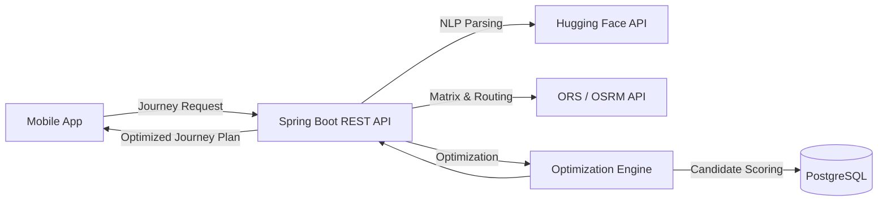
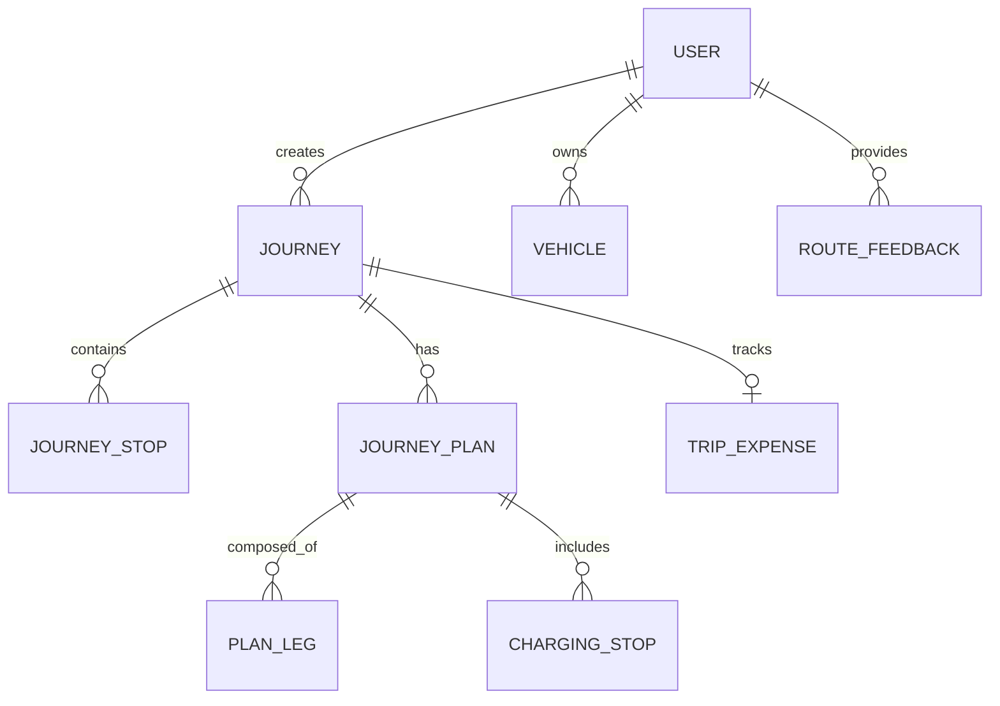

# SmartRoute: Intelligent Multi-Stop Journey Optimization Platform

Welcome to the **SmartRoute** monorepo. SmartRoute is a comprehensive, production-oriented application containing a Spring Boot backend and a React Native Expo mobile frontend. It aims to optimize complex, multi-stop journeys by taking into account time windows, various constraints, and user preferences, providing an AI-powered route planning experience.

## Project Overview

SmartRoute is designed for users who need to plan intricate trips involving multiple stops—such as errands, meetings, or EV charging stations. Instead of manually ordering locations, users can simply state their needs (even using natural language), and the system automatically calculates the most efficient sequence. It caters to daily commuters, field workers, and electric vehicle owners who need a smart, adaptive assistant that learns their preferences over time.

---

## Problem Statement

Planning multi-stop trips manually is a cognitively heavy task. In computer science, this is known as the Vehicle Routing Problem with Time Windows (VRPTW), which is NP-Hard. 

When a user needs to visit a bank before 12:00, pick up a package, and attend a meeting at 14:00, they must manually calculate travel times, traffic risks, and routing sequences. Traditional map applications only provide A-to-B routing or force the user to manually sort their waypoints. This leads to sub-optimal routes, wasted fuel, increased toll costs, and missed deadlines.

---

## Solution

SmartRoute solves this by combining advanced mathematical optimization with modern API integrations:

1. **Input Parsing:** Users can input their journey manually or use the NLP engine to parse free-text (e.g., "I need to visit the bank at 10 AM, then grab a coffee").
2. **Matrix Calculation:** The system fetches a complete distance and duration matrix between all points using external providers (OpenRouteService/OSRM).
3. **Algorithmic Optimization:** The `OptimizationEngine` filters out physically impossible time-window combinations, then generates candidate routes using Brute-Force (for small routes) or Nearest Neighbor + 2-Opt heuristics (for larger routes).
4. **Multi-Objective Scoring:** Candidate routes are scored against multiple dimensions (Time, Cost, Distance, Traffic Risk, Parking Difficulty) tailored to the user's learned profile.
5. **Leg Routing:** Exact polylines and turn-by-turn data are fetched for the winning sequence and presented to the user.



---

## Key Features

- **AI-Powered Natural Language Planning**: Convert free-text requests into structured route data using a Hugging Face LLM integration.
- **Advanced Route Optimization**: Implements VRPTW optimization capable of handling strict time windows and visit durations.
- **Multi-Objective Routing Profiles**: Generates multiple plan alternatives ('fastest', 'cheapest', 'balanced', 'recommended') based on weighted scores.
- **Preference Learning**: Automatically adapts to user choices over time using an Exponential Moving Average (EMA) algorithm, continually refining the "recommended" profile.
- **Electric Vehicle (EV) Support**: Integrates EV specific constraints (battery capacity, energy consumption) into route planning.
- **Departure Time Optimization**: Suggests the statistical best time to depart to maximize the probability of arriving on time under varying traffic models.
- **Resilient Infrastructure**: Uses Resilience4j circuit breakers to gracefully handle external routing API failures.

---

## Technology Stack

| Technology | Purpose |
| --- | --- |
| **Java 21** | Programming Language |
| **Spring Boot 3.3.2** | Backend Application Framework |
| **PostgreSQL 16 & PostGIS** | Relational & Spatial Database |
| **Spring Data JPA** | Persistence Layer |
| **Flyway** | Database Schema Migration |
| **Redis** | Rate Limiting & Caching |
| **Resilience4j** | Circuit Breaking & Fault Tolerance |
| **React Native (Expo)** | Mobile Application Framework |
| **TypeScript** | Type-safe Frontend Development |
| **Zustand** | Mobile State Management |
| **Hugging Face API** | Natural Language Processing (LLM) |
| **OpenRouteService (ORS) / OSRM**| Routing & Distance Matrix Engines |
| **Docker & Docker Compose** | Containerization for Local Infrastructure |

---

## Architecture

The backend implements a robust **Layered Architecture**:

- **Controller Layer (`/controller`)**: Exposes RESTful endpoints, handles HTTP requests, and validates input DTOs.
- **Service Layer (`/service`)**: Contains the core business logic. Subdivided by domain (`journey`, `nlp`, `places`, `routing`, `user`). The `OptimizationEngine` resides here, cleanly separated from external I/O.
- **Repository Layer (`/repository`)**: Spring Data JPA interfaces for database operations.
- **Domain Layer (`/domain`)**: JPA Entities representing the database tables.
- **Configuration & Security (`/config`, `/security`)**: Handles JWT-based stateless authentication and external provider configurations.
- **Exception Handling (`/exception`)**: A global `@RestControllerAdvice` translates domain exceptions into standardized HTTP error responses.

---

## Project Structure

```text
SmartRoute/
├── .github/workflows/       # GitHub Actions CI/CD pipelines
├── backend/                 # Spring Boot Backend
│   ├── src/main/java/com/smartroute/
│   │   ├── config/          # Configurations (Security, Beans)
│   │   ├── controller/      # REST APIs (Journey, Auth, Vehicle)
│   │   ├── domain/          # Entities (Journey, JourneyStop, User, etc.)
│   │   ├── dto/             # Request/Response data models
│   │   ├── exception/       # Global exception handlers
│   │   ├── mapper/          # Object mappers
│   │   ├── repository/      # Spring Data JPA repositories
│   │   ├── security/        # JWT Authentication mechanisms
│   │   └── service/         # Business logic (Optimization, NLP, Routing)
│   └── src/main/resources/
│       ├── db/migration/    # Flyway SQL migrations (V1 to V7)
│       └── application.properties
├── mobile/                  # React Native Expo App
│   ├── app/                 # Expo Router file-based routing
│   │   ├── (auth)/          # Login & Register flows
│   │   └── (tabs)/          # Main application tabs (Journey, History)
│   └── src/
│       ├── api/             # Axios API client services
│       ├── components/      # Reusable UI components
│       ├── store/           # Zustand state stores
│       └── types/           # TypeScript interfaces
└── docker-compose.yml       # Local Postgres + Redis environment
```

---

## How It Works

A typical journey optimization request flows as follows:

1. **Client Request**: The mobile app sends a `POST /api/v1/journeys/{id}/optimize` request containing journey parameters.
2. **Matrix Fetching**: The `RoutingProvider` fetches a complete distance and duration matrix between the origin, destination, and all waypoints via ORS/OSRM.
3. **Pre-filtering**: The `OptimizationEngine` checks if any critical time windows overlap in a physically impossible way. If so, it throws an `InfeasiblePlanException`.
4. **Candidate Generation**:
   - For ≤ 8 stops: Generates all possible permutations (Brute-Force).
   - For > 8 stops: Uses a Nearest Neighbor construction heuristic followed by a 2-Opt local search to find near-optimal paths in milliseconds.
5. **Multi-Objective Evaluation**: Candidates are scored using the `findBestPermutationForProfile` method. The scoring considers travel time, distance, fuel cost, traffic risks, and parking difficulties, weighted according to the user's preference profile.
6. **Leg Routing**: The exact polyline and step-by-step navigation data for the winning permutation are fetched.
7. **Persistence & Response**: The resulting `JourneyPlan` and `PlanLeg`s are saved to the database and returned to the client for rendering.

---

## Database Design

The system uses PostgreSQL. The core routing domain is highly relational.



- **`journeys`**: The root aggregate containing origin/destination and metadata.
- **`journey_stops`**: Specific waypoints, including time windows and priorities.
- **`journey_plans`**: Optimized route candidate outputs (e.g., 'fastest', 'balanced').
- **`plan_legs`**: Individual segment data between two stops, storing encoded polylines and exact metrics.

---

## API Documentation

The backend exposes RESTful endpoints.

**Auth & Users**
- `POST /api/v1/auth/login`: Authenticate and receive a JWT.
- `GET /api/v1/users/settings`: Fetch user application preferences.

**Journey Management (`/api/v1/journeys`)**
- `POST /api/v1/journeys/parse-nlp`: Uses LLM to extract a `JourneyRequest` from natural language.
- `POST /api/v1/journeys`: Create a draft journey.
- `POST /api/v1/journeys/{id}/optimize`: Trigger the VRPTW optimization engine.
- `POST /api/v1/journeys/{id}/plans/{planId}/select`: Select a specific generated plan.
- `POST /api/v1/journeys/{id}/departure-suggestions`: Retrieve statistical departure time suggestions.

**Routing Algorithm Testing (`/api/v1/routes/calculate`)**
Direct access to the underlying matrix and sorting algorithm without saving to the DB.

---

## Validation

Input validation is enforced using Jakarta Bean Validation (`@Valid`, `@NotNull`, `@NotBlank`) at the Controller layer. This ensures bad requests are caught before hitting the business logic.

Domain-level validation (e.g., ensuring a time window start is before its end, or checking if travel times violate hard deadlines) is strictly enforced in the Service layer, throwing specific domain exceptions.

---

## Exception Handling

A centralized `GlobalExceptionHandler` ensures all API responses follow a consistent format.

- **`InfeasiblePlanException`**: Thrown by the optimization engine if the user's time windows are physically impossible to meet. Returns a `422 Unprocessable Entity` with details on the conflicting stops.
- **`RateLimitExceededException`**: Thrown when NLP usage exceeds daily limits. Returns `429 Too Many Requests`.
- **`MethodArgumentNotValidException`**: Caught globally to return a map of validation errors (`400 Bad Request`).
- **`JWTVerificationException`**: Catches expired or tampered tokens, returning `401 Unauthorized`.

---

## Configuration

The application is configured primarily through `application.properties` and environment variables. Sensitive data should be placed in a `.env` file at the root of the backend directory.

```bash
# backend/.env
DATABASE_URL=jdbc:postgresql://localhost:5432/smartroute
DATABASE_USER=postgres
DATABASE_PASSWORD=password
JWT_SECRET=your_super_secret_jwt_key
ORS_BASE_URL=https://api.openrouteservice.org
ORS_API_KEY=your_ors_api_key
HUGGINGFACE_API_KEY=your_hugging_face_api_key
REDIS_HOST=localhost
REDIS_PORT=6379
```

---

## Installation & Setup

### Requirements
- **Java 21**
- **Maven**
- **Node.js 20+**
- **Docker & Docker Compose**

### 1. Database & Cache Infrastructure
SmartRoute uses PostgreSQL (with PostGIS) and Redis. Spin them up quickly using Docker:

```bash
docker compose up -d
```
*Wait for the containers to initialize and report healthy.*

### 2. Backend Setup

```bash
cd backend
cp .env.example .env
# Edit .env with your specific API keys and secrets.
./mvnw clean package
./mvnw spring-boot:run
```
*The API will be available at `http://localhost:8082`. Flyway will automatically run migrations.*

### 3. Mobile Setup

```bash
cd mobile
cp .env.example .env
# Important: Update EXPO_PUBLIC_API_URL in .env to point to your machine's local IP if testing on a physical device!
npm install
npm run start
```
*Use the Expo Go app on your phone, or press `i` / `a` in the terminal to launch the iOS simulator or Android emulator.*

---

## Docker

The `docker-compose.yml` at the root of the project provides the necessary infrastructure.
- `smartroute-postgres`: A `postgis/postgis:16-3.4` container handling the relational database.
- `smartroute-redis`: A `redis:7-alpine` container used for rate-limiting (e.g., NLP requests) and caching.

*Note: The Spring Boot and Expo applications are intended to be run natively during development.*

---

## Testing

The backend is heavily tested using JUnit 5 and Mockito.

- **Unit Tests**: Found extensively in the `service/journey` package, thoroughly testing the `OptimizationEngine`, `DepartureOptimizerService`, and `ExplainabilityService`.
- **Integration Tests**: Controller tests (`AuthControllerIntegrationTest`, `SettingsControllerIntegrationTest`) use `MockMvc` and `Testcontainers` (spinning up a disposable PostgreSQL container) to verify end-to-end database interactions and routing.

To run the test suite:
```bash
cd backend
./mvnw test
```

---

## Performance & Scalability

- **Algorithmic Scaling**: The VRPTW is $O(n!)$. Brute force works perfectly up to 8 stops, ensuring the absolute best route. For 9-20 stops, the engine gracefully transitions to a Nearest Neighbor + 2-Opt heuristic, maintaining sub-3-second response times without sacrificing much accuracy.
- **Circuit Breakers**: Interactions with OpenRouteService and OSRM are wrapped in Resilience4j circuit breakers. If an external API fails repeatedly, the circuit opens, preventing system-wide thread exhaustion and failing fast.
- **N+1 Protections**: JPA relationships are carefully configured with `FetchType.LAZY`, and custom `@Query` repository methods use `JOIN FETCH` where necessary to avoid N+1 query problems when loading complete journeys and plans.

---

## Security Considerations

- **Stateless Authentication**: Uses JWT. No session state is stored on the server, enhancing horizontal scalability.
- **Endpoint Protection**: Spring Security is configured to require authentication for all `/api/v1/**` routes, except explicitly whitelisted paths like `/auth/login` and `/auth/register`.
- **Resource Ownership**: Controllers and Services strictly check if the `Journey` or `Vehicle` being modified actually belongs to the authenticated user via their `UUID`.
- **Input Validation**: Robust DTO validation mitigates injection and payload tampering.

---

## Development Guidelines

- **Adding an Entity**: Create the entity in `domain/`, map it to DTOs in `dto/`, add a Flyway migration script in `resources/db/migration/` (incrementing the version number), and create the corresponding `Repository`.
- **Adding a Routing Provider**: Implement the `RoutingProvider` interface. The architecture allows seamlessly swapping between Google Maps, ORS, or OSRM by changing the implementation injected into the services.
- **Mobile State Management**: When creating new complex multi-screen flows in the React Native app, utilize Zustand (`src/store/`) rather than passing props deeply.

---

## Future Improvements

**High Priority**
- Add Live Traffic overlay integration for more accurate ETA predictions on the client side.
- Implement real-time turn-by-turn navigation directly within the Expo app.

**Medium Priority**
- Expand EV support to auto-insert charging stations mid-route based on battery SoC (State of Charge).
- Cache distance matrix results in Redis to reduce external API calls and latency.

**Low Priority**
- Support multi-vehicle fleet optimization for small logistics businesses.

---

## Learning / Concepts Demonstrated

This project serves as an advanced demonstration of several key engineering concepts:
- **NP-Hard Algorithm Optimization**: Implementing practical heuristics (Nearest Neighbor, 2-Opt) to solve VRPTW.
- **Preference Learning**: Using Exponential Moving Average (EMA) to dynamically adapt weights based on user feedback.
- **Modern Monorepo Tooling**: Combining Spring Boot and React Native in a streamlined CI pipeline.
- **Resilient Microservice Design**: Implementing Circuit Breakers (Resilience4j) around external dependencies.
- **LLM Integration**: Using Hugging Face's API to bridge the gap between natural language and structured backend APIs.

---

## FAQ

**Why use heuristics instead of always using brute-force for routing?**
The Traveling Salesperson Problem scales factorially ($O(n!)$). Computing all permutations for 10 stops takes over 3.6 million iterations. Heuristics provide near-optimal solutions in milliseconds, which is critical for a responsive user experience.

**Why is PostGIS used?**
While basic coordinate storage only needs floats, PostGIS enables advanced geospatial queries efficiently, which is foundational for features like "find parking within 500m of this stop".

**How does Preference Learning work?**
When a user selects a generated route alternative (e.g., picking the 'fastest' instead of 'economic' option), the `PreferenceLearningService` applies an Exponential Moving Average to update their internal weightings. Over time, the algorithm's "recommended" route adapts to their historical choices.

---

## License

This project's mobile application is under the MIT License. See `mobile/LICENSE` for details.
